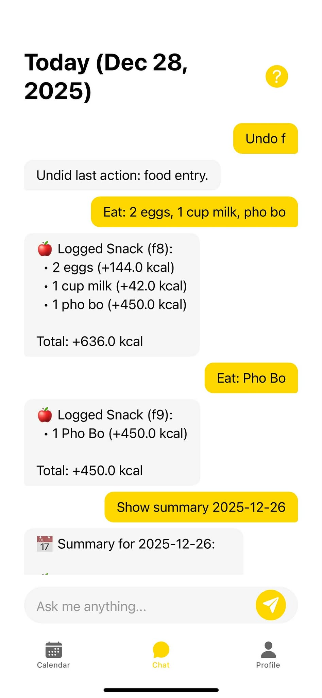
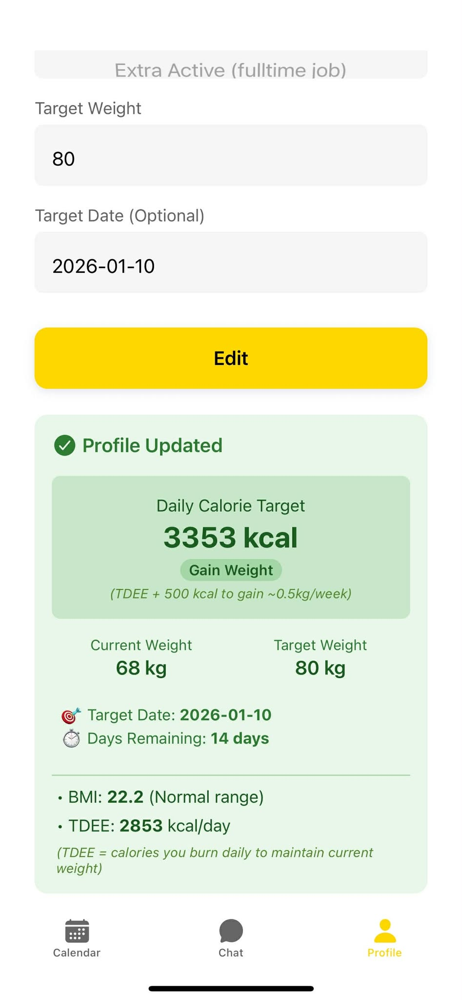
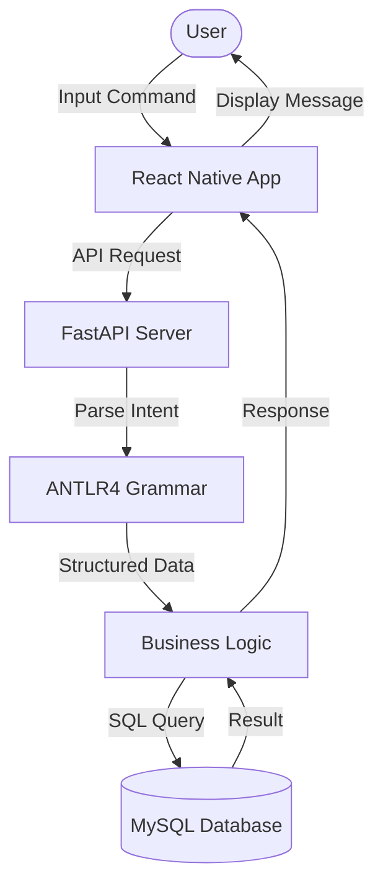

# Calorie Tracking Chatbot


A comprehensive mobile application for tracking calories and nutrition through an intelligent chatbot interface. This project features a React Native (Expo) frontend and a robust FastAPI backend powered by Python.

## 🚀 Technologies

### Frontend
- **Framework:** React Native (Expo)
- **Language:** TypeScript
- **Routing:** Expo Router
- **UI:** Custom components with modern styling

### Backend
- **Framework:** FastAPI
- **Language:** Python 3.9+
- **Database:** MySQL (Dockerized)
- **Database Driver:** MySQLClient (Raw SQL)
- **NLP:** ANTLR4 (for parsing natural language commands)

## ✨ Features

- **Intelligent Chat Interface:** Log food and exercises simply by typing natural language commands (e.g., "I ate an apple and ran for 30 mins").
- **Daily Dashboard:** View your daily summary and remaining calories.
- **Calendar View:** Track your history and view logs from previous days.
- **Profile & Goals:** Customize your profile and set specific calorie and weight goals.
- **Smart Data Management:** Edit, delete, moved entries, or undo your last action using natural language commands.

## 📸 Screenshots

| Home & Dashboard | Chat Interface | Profile & Goals |
|------------------|----------------|-----------------|
|  |  |  |
| *Daily summary view* | *Natural language logging* | *Settings and targets* |



## 🛠️ Installation & Setup

### Prerequisites
- Node.js & npm
- Python 3.9+
- Docker & Docker Compose
- Expo Go app on your mobile device (for testing)

### 1. Backend Setup

The backend requires a MySQL database running via Docker.

1. Navigate to the backend directory:
   ```bash
   cd backend
   ```

2. Create a virtual environment and install dependencies:
   ```bash
   python -m venv venv
   source venv/bin/activate  # On Windows: venv\Scripts\activate
   pip install -r requirements.txt
   ```

3. Create a `.env` file in the `backend` directory (copy from `.env.example` if available) and configure your database credentials.

4. Start the Database:
   ```bash
   docker-compose up -d
   ```

5. Start the API Server:
   ```bash
   # On Windows
   run_server.bat
   
   # Or manually:
   uvicorn app.main:app --reload --host 0.0.0.0 --port 8000
   ```
   The backend will start at `http://0.0.0.0:8000`.
   
   > **💡 Tip:** Once the server is running, you can access the interactive API documentation at [http://localhost:8000/docs](http://localhost:8000/docs) or [http://localhost:8000/redoc](http://localhost:8000/redoc).

### 2. Frontend Setup

1. Navigate to the frontend directory:
   ```bash
   cd frontend
   ```

2. Install dependencies:
   ```bash
   npm install
   ```

3. **IMPORTANT: Configuration**  
   Before running the app, you **must** configure the API endpoint to point to your computer's local IP address.
   
   Open `frontend/config/api.ts` and locate the `LOCALHOST` variable:
   ```typescript
   // frontend/config/api.ts
   
   // CHANGE '192.168.1.5' to your machine's actual Local IP Address
   const LOCALHOST = Platform.OS === 'android' ? '10.0.2.2' : '192.168.1.X'; 
   ```
   *Note: If testing on an Android Emulator, `10.0.2.2` usually works. If testing on a physical device, use your machine's LAN IP (e.g., `192.168.1.100`).*

4. Start the Application:
   ```bash
   npx expo start
   ```
   - Scan the QR code with your phone (using Expo Go) or press `a` to run on an Android emulator.

## 📝 Usage

The chatbot uses a structured natural language format. Below are the supported command patterns:

### 🍎 Food Logging
*Format: `[Meal]: [Quantity] [Unit] [Food Name] [Calories Note]`*
```text
Breakfast: 2 eggs, 1 slice bread
Lunch: 1 bowl pho bo (450kcal), 300ml coke
Dinner: 200g steak, salad
Snack: 1 apple (95kcal)
Eat: 1 banana
Drink: 500ml water
```

### 🏃 Exercise Logging
*Format: `Exercise: [Verb] [Duration/Distance]`*
```text
Exercise: run 30 min
Exercise: walk 2 km
Exercise: swim 45 min
Exercise: do 20 pushups
```

### ✏️ Editing & Deleting
```text
Edit f1: 3 eggs      # Edit food entry #1
Delete f1            # Delete food entry #1
Move f1 to Dinner
```

### 📊 Statistics
```text
Show summary today
Show weekly stats
```

### ⚙️ Profile
```text
Set weight 70 kg
Set goal lose 0.5 kg
```
